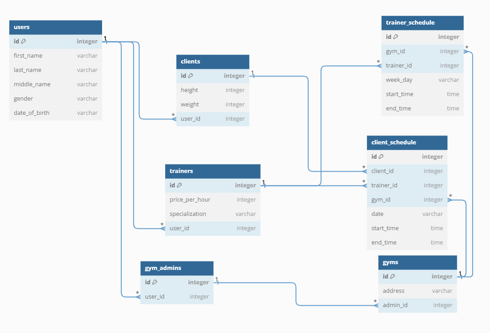

## Executing program

Клонирование:

```sh
$ git clone https://github.com/Cagey7/fitness_api.git
$ cd fitness_api
```

### Запуск с докером

1) Поменяйте название файла .env.example на .env
2) Запустите одну из команд снизу в зависимости от желаемых настроек

```sh
$ docker compose -f development.yml up
```

```sh
$ docker compose -f production.yml up
```

### Запустить локально

1) Создать виртуальную среду

```sh
$ python -m venv venv
$ .\venv\Scripts\activate
```

2) Установить зависимости

```sh
(venv) $ pip install -r .\requirements\development.txt
```

ВАЖНО! Введите ваши настройки базы данных в файл technoshop/settings/development.py

3) Запустите миграцию

```sh
(venv) $ python manage.py migrate --settings=fitness_api.settings.development
```

4) Если хотите заполнить базу данных данными можете запустить

```sh
(venv) $ python manage.py loaddata data.json --settings=fitness_api.settings.development
```

5) Запустите приложение

```sh
(venv) $ python manage.py runserver --settings=fitness_api.settings.development
```

## Документация (swagger)

Чтобы открыть документацию пройдите по пути http://127.0.0.1:8000/swagger/ или http://127.0.0.1:8000/redoc/


## Структура базы данных

Я использовал таблицу Users предоставляемую джанго, чтобы у всех пользователей был функционал аутентификации и другое, что предоставляет джанго. Я ее модифицировали, чтобы добавить недостающие поля middle_name, date_of_birth, gender. А пользователей по ролям я разделил с помощью связи one-to-one с таблицей Users.

Информация о расписание тренеров храниться в таблице trainer_schedule, а информация о расписание занятий храниться в таблице client_schedule.

Примерная получившейся база данных


